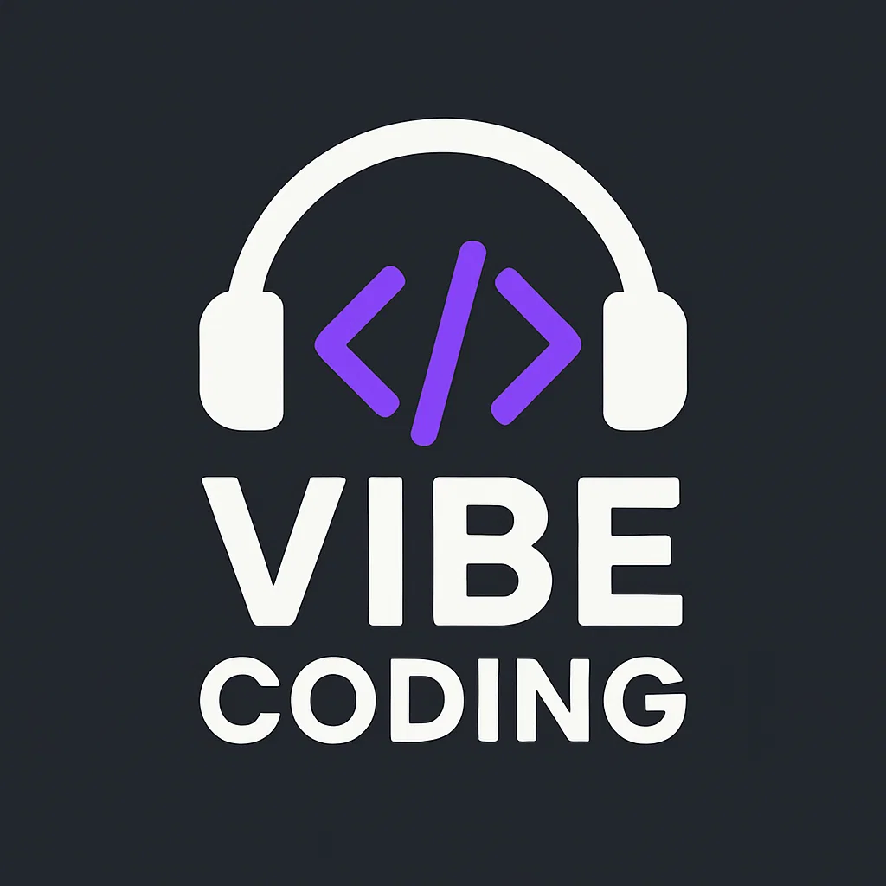

# Vibe Coding (VIBE)

[BUY TOKEN](https://pump.fun/coin/FWAUjiMZv4Hh6CR8m8m6QGb1k5hkhxWHHZ2ewXVTpump) | [RESOURCES](./resources.md) | [TELEGRAM](https://t.me/vibecoding_vibe)

Vibe Coding ($VIBE) is a Solana based access token for builders who enjoy “vibe coding” with modern tools, AI copilots, and collaborative workflows. VIBE is designed as a community access token: a way to join a shared coding space, earn recognition, and unlock member‑only channels and resources.

**Contract Adress:** [FWAUjiMZv4Hh6CR8m8m6QGb1k5hkhxWHHZ2ewXVTpump](https://pump.fun/coin/FWAUjiMZv4Hh6CR8m8m6QGb1k5hkhxWHHZ2ewXVTpump)

## What Vibe Coding Is (and Is Not)

Vibe Coding is a fan‑driven tech community, not an investment product or trading scheme. Holding VIBE is intended to function like a digital access pass or membership key for coders, not a claim on profits, equity, or revenue. Participation is entirely optional and at‑will, and there are no promises that VIBE will have any particular market value or price.

The community focuses on shared learning, experimentation, and open collaboration. Tokens, NFTs, and badges are used as credentials and access tools inside the ecosystem, not as guarantees of financial returns.

## Platforms and Tools We Explore

Vibe Coding is tooling‑agnostic and encourages members to bring their favorite environments:

- Replit for rapid prototyping, pair programming, and sharing live coding sandboxes.
- Cursor and other AI‑assisted editors for “vibe coding” with inline suggestions, refactors, and chat‑driven workflows.
- AI agents and automation frameworks for building bots, helpers, and background workers that support the community.
- Solana tooling for experimenting with on‑chain scripts, bots, and dashboards

